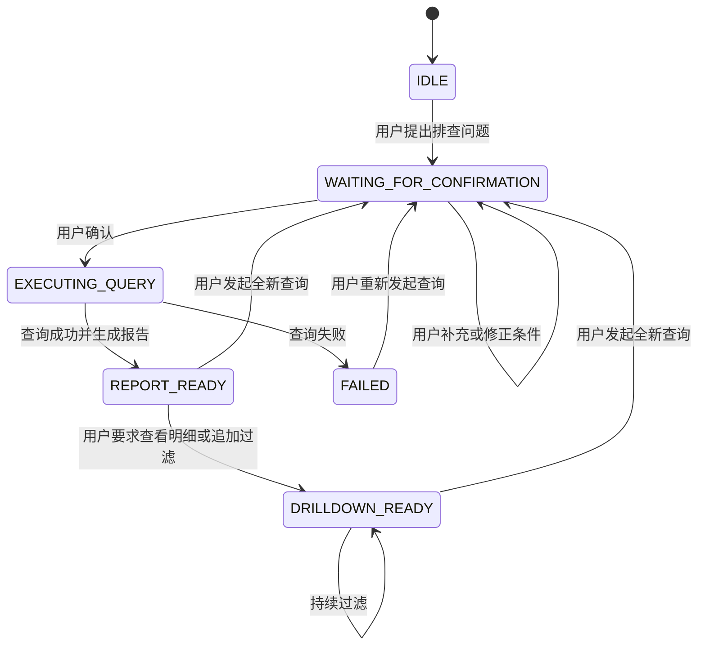
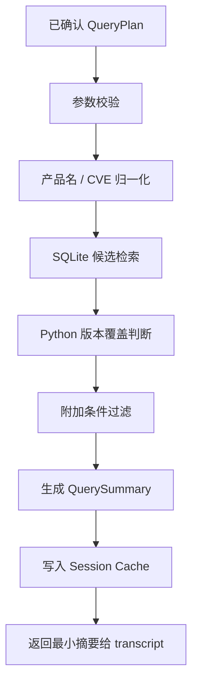
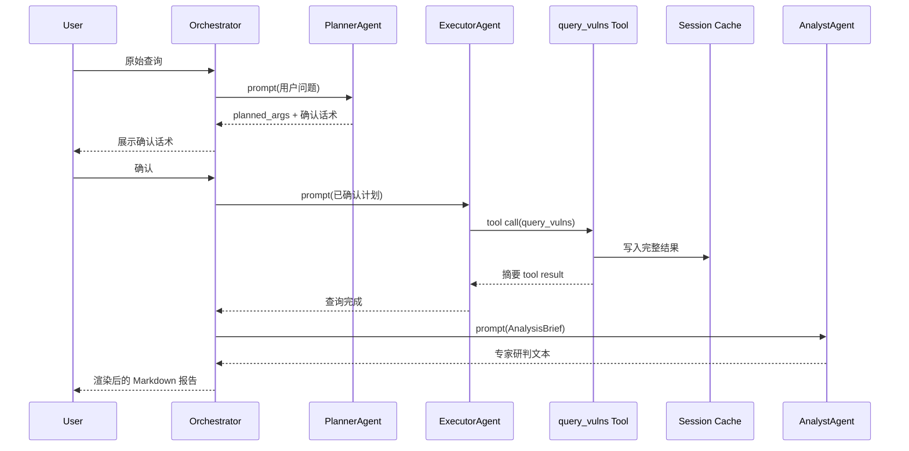
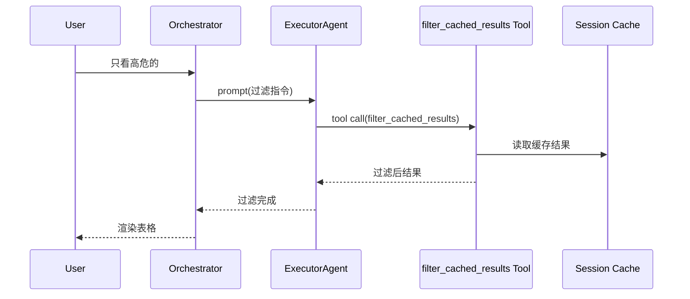

# VulnHelper 概要设计

## 一、文档目的

本文档用于指导在 `agent_apps/vulnhelper/` 下实现一个基于 `agentsdk` 的漏洞查询助手。该助手面向“漏洞排查、版本影响判断、修复建议生成、结果下钻过滤”这类安全运营场景，目标是在尽量利用 LLM 自然语言理解和 Tool Calling 能力的同时，把查询参数、执行流程、数据暴露范围和最终输出格式牢牢控制在应用层。

本文档只讨论总体设计和模块边界，不展开到每个 Python 文件的详细接口签名和伪代码。后续若进入编码阶段，应基于本文档再补一份详细设计或实现任务拆解。

## 二、设计目标

本次设计的核心目标有四个。

第一，严格满足当前需求中的四阶段交互模型：先意图收敛和确认，再受控查询，再生成结构化研判报告，最后支持基于会话内存的局部下钻。

第二，把 `agentsdk` 作为 Runtime Kernel 使用，而不是把它误当成“自带会话状态机和业务记忆的完整平台”。`agentsdk` 负责多轮对话、工具调用、事件和状态快照；业务阶段流转、查询缓存、模板渲染和权限边界由 `vulnhelper` 应用层负责。

第三，尽量降低 LLM 的自由度，尤其是在阶段二和阶段四。模型可以做语义解析、参数编译和安全建议生成，但不能绕过确认直接查库，也不能越权访问全量漏洞明细。

第四，使后续实现能够稳定通过基于 `agent_apps/vulnhelper/tests/` 中样例构造的回归测试，包括版本线判断、按 CVE 定位、按恶意包识别，以及按 POC / 修复方案 / 风险等级组合过滤等场景。

## 三、非目标

本次设计明确不追求以下事项。

不实现跨会话长期记忆。当前缓存只服务于单个会话或单个运行上下文，不做用户级长期知识沉淀。

不实现自动联网抓取外部漏洞情报。当前主数据源固定为本地 SQLite 漏洞库，必要时只保留后续扩展口。

不实现复杂多 Agent 自主协作或自动拆任务。这里的“多 Agent”仅指按职责拆分不同逻辑代理，由应用编排层顺序调度，而不是让多个 Agent 自由互相对话。

不把报告渲染责任交给模型。最终卡片和表格的结构由程序模板固定，LLM 只负责其中的自然语言分析片段。

## 四、需求重述

根据 [需求说明.md](/Users/bg/project/uu-work/agent_apps/vulnhelper/需求说明.md:1)，本应用采用四阶段模型。

阶段一负责将用户自然语言问题收敛为结构化查询意图，并生成确认话术，不触发真实查询。

阶段二在得到用户授权后，触发受控 Tool Calling，将查询参数传给本地 Python 工具，完成实体归一化、版本区间覆盖计算和本地漏洞库检索。

阶段三基于阶段二产生的硬指标和摘要信息，生成固定结构的 Markdown 安全研判报告。

阶段四在同一会话内响应用户进一步的过滤或下钻需求，直接在内存缓存中筛选漏洞明细，避免重复查库。

这四阶段中，LLM 的角色分别是：规划师、参数构造器、安全咨询专家和过滤指令编译器；程序的角色始终是：状态机、执行核心、缓存拥有者和最终渲染者。

## 五、总体设计原则

### 5.1 Runtime Kernel 与业务编排解耦

`agentsdk` 只负责：

- `Agent` 生命周期与多轮 transcript 管理
- tool calling 主循环
- `before_tool_call` / `after_tool_call` hook
- 状态快照与事件订阅
- 模型适配和流式输出

`vulnhelper` 应用层负责：

- 会话状态机
- 查询计划暂存与授权控制
- 查询缓存与过滤缓存
- 版本语义和漏洞筛选逻辑
- Markdown 模板渲染
- 前端或 CLI 侧交互协议

### 5.2 阶段驱动而非“单 Agent 自由发挥”

虽然 `agentsdk` 可以把工具和模型放到一个 Agent 中自由迭代，但本场景不应这样做。原因有三点。

第一，阶段一明确要求“只解析，不查库”；如果把规划和执行混在一个 Agent 中，就只能依赖 prompt 约束，而无法在结构上保证模型看不到工具。

第二，阶段二要求参数必须严格基于阶段一确认后的 `planned_args`，不能被模型临时篡改；这需要外层状态机和 hook 双重控制。

第三，阶段三要求全量漏洞数据不直接暴露给模型；若使用单 Agent 全程自动循环，则工具结果天然进入 transcript，增加数据外泄和提示污染的风险。

### 5.3 结果最小暴露

应用层缓存完整数据，模型只看到必要摘要。查询工具返回的原始完整结果应写入 `Session Cache`，进入 transcript 的工具结果只保留摘要文本与必要元信息。

### 5.4 输出格式由模板决定

最终确认话术、结构化报告和下钻表格都不交给模型自由组织，而由程序在固定骨架中填充内容。模型只负责生成确认口吻、分析段落和过滤参数。

## 六、推荐架构

### 6.1 总体分层

建议采用如下四层结构：

```text
Presentation
  CLI / HTTP API / 前端适配

Application
  VulnHelperOrchestrator
  SessionManager
  Renderers

Domain
  QueryPlan / SessionState / QuerySummary / FilterSpec
  VersionMatcher / VulnFilter / Normalizer

Infrastructure
  agentsdk Agent 封装
  SQLite Repository
  In-Memory Session Cache
```

其中最关键的是 `VulnHelperOrchestrator`。它不是简单的控制器，而是整个业务流程的状态流转中心。

### 6.2 推荐的逻辑 Agent 拆分

建议拆成三个逻辑 Agent。

#### PlannerAgent

只负责阶段一。

- 无工具
- 输入：用户原始问题
- 输出：
  - `planned_args` 结构化 JSON
  - 用户确认话术

该 Agent 的系统提示词应明确禁止生成 Tool Call，并要求输出稳定可解析的结构。

#### ExecutorAgent

负责阶段二和阶段四。

- 只挂受控工具
- 输入：用户确认信号、已确认的 `planned_args`，或阶段四的局部过滤指令
- 输出：
  - 阶段二：工具调用请求，再由程序执行和缓存结果
  - 阶段四：过滤工具调用请求

该 Agent 的职责不是“解释”，而是“按给定 schema 编译出工具参数”。

#### AnalystAgent

只负责阶段三。

- 无工具
- 输入：程序从缓存中提取的核心指标摘要
- 输出：专家研判与修复推演文本

它不读取 CVE 明细列表，不直接接触完整结果集。

### 6.3 为什么不推荐单 Agent

单 Agent 的主要问题是边界不稳：

- 工具一旦注册，就需要依赖 prompt 才能避免阶段一误调用
- tool result 默认进入 transcript，后续轮次很容易把完整结果继续喂给模型
- 调用阶段和展示阶段难以分离，容易让模型生成不稳定格式

因此，推荐用多个逻辑 Agent 配合一个外部 Orchestrator，而不是让一个大 Agent 自己做全部事情。

## 七、会话状态机设计

### 7.1 状态定义

建议定义如下会话状态：

- `IDLE`：空闲状态，尚未形成有效查询计划
- `WAITING_FOR_CONFIRMATION`：已提取 `planned_args`，等待用户确认
- `EXECUTING_QUERY`：正在执行阶段二查询
- `REPORT_READY`：查询与报告已完成，可继续下钻
- `DRILLDOWN_READY`：已经执行过至少一次下钻过滤，仍可继续过滤
- `FAILED`：本轮出现致命错误

### 7.2 状态转移



### 7.3 状态机控制原则

状态转移必须由程序显式驱动，而不是依赖 transcript 的“最后一条消息类型”去猜。

尤其是 `WAITING_FOR_CONFIRMATION` 到 `EXECUTING_QUERY` 的跳转，必须同时满足：

- 当前会话确实存在完整 `planned_args`
- 用户输入被判定为确认或授权
- 尚未执行过与该计划对应的真实查询

## 八、核心数据结构设计

### 8.1 会话对象

建议定义 `VulnSession` 作为业务主对象，至少包含以下字段。

```python
VulnSession(
    session_id: str,
    state: SessionState,
    planned_args: QueryPlan | None,
    last_query_result: CachedQueryResult | None,
    last_report: RenderedReport | None,
    last_filter_spec: FilterSpec | None,
    metadata: dict[str, Any],
)
```

说明如下：

- `session_id` 由应用层生成，不依赖 `agentsdk` 自动维护
- `planned_args` 保存阶段一确认前后的计划参数
- `last_query_result` 保存阶段二返回的完整结构化结果
- `last_report` 保存上一次报告文本，便于前端重放或审计
- `last_filter_spec` 保存最近一次阶段四过滤条件

### 8.2 查询计划对象

建议把阶段一产物标准化为 `QueryPlan`，字段可设计为：

```python
QueryPlan(
    entry_mode: Literal["product_version", "identifier", "filter_only", "malicious_package"],
    product: str | None,
    version_spec: str | None,
    vuln_id: str | None,
    risk_levels: list[str],
    require_public_poc: bool | None,
    require_solution: bool | None,
    malicious_only: bool | None,
    source_hint: str | None,
    user_goal: Literal["impact_check", "fix_version", "triage", "detail_search"],
)
```

该结构需要能覆盖当前样例中的几类问题：

- “某软件某版本是否受影响”
- “某 CVE 对某产品是否受影响”
- “有没有高危且存在公开 POC 的漏洞”
- “某包是不是恶意投毒包”

### 8.3 查询缓存对象

阶段二查询结束后，建议把完整结果保存为 `CachedQueryResult`：

```python
CachedQueryResult(
    cache_id: str,
    query_plan: QueryPlan,
    matched_records: list[VulnRecord],
    summary: QuerySummary,
    created_at: datetime,
)
```

其中 `summary` 需至少包含：

- 查询入口类型
- 初始候选条数
- 过滤后条数
- 当前版本是否受影响
- 全局最低修复版本
- 同版本线建议修复版本
- 是否存在公开 POC
- 是否存在修复方案
- 最高风险等级

### 8.4 过滤参数对象

阶段四建议统一成 `FilterSpec`：

```python
FilterSpec(
    risk_levels: list[str] | None,
    has_public_poc: bool | None,
    has_solution: bool | None,
    malicious_only: bool | None,
    cve_ids: list[str] | None,
    limit: int | None,
)
```

该结构尽量保持幂等和可组合，便于在同一缓存集上持续叠加过滤。

## 九、工具设计

### 9.1 工具总原则

工具只负责确定性执行，不负责自然语言解释。所有工具都应遵循以下原则：

- 输入参数必须是稳定 schema
- 输出同时包含对程序可消费的 `details` 与对 transcript 可消费的 `content`
- 不直接操作前端，不直接拼接最终 Markdown 报告

### 9.2 阶段二主工具：`query_vulns`

建议定义一个主查询工具 `query_vulns`。它承担如下职责：

1. 校验查询参数合法性
2. 执行产品名归一化、漏洞编号归一化
3. 基于本地 SQLite 做候选集检索
4. 在 Python 层完成版本区间覆盖判断
5. 应用风险、POC、修复方案、恶意包等过滤条件
6. 形成结构化摘要和完整结果集
7. 把完整结果写入 `Session Cache`

工具返回时：

- `details` 放完整结构化结果
- `content` 只放摘要，例如“本次检索命中 3 条记录，摘要已生成”

### 9.3 阶段四工具：`filter_cached_results`

该工具直接从当前会话缓存中读取 `CachedQueryResult.matched_records`，执行局部过滤，不再访问数据库。

职责包括：

1. 校验当前会话是否已有缓存结果
2. 依据 `FilterSpec` 执行内存过滤
3. 返回过滤后的精简记录列表
4. 返回表格渲染所需的列值

### 9.4 是否需要更多工具

初版不建议拆太多工具。`query_vulns` 与 `filter_cached_results` 足够覆盖四阶段主流程。

如果未来需要增强，可补以下工具，但不应在第一版实现：

- `explain_fix_strategy`
- `compare_versions`
- `load_cve_detail`

这些能力当前都可以通过程序内函数和 AnalystAgent 配合完成，无需提前工具化。

## 十、查询执行设计

### 10.1 Repository 层

建议实现 `VulnRepository`，屏蔽 SQLite 访问细节。至少提供以下查询能力：

- `find_by_cve_id(cve_id)`
- `find_by_product_keywords(product)`
- `find_malicious_package(package_name)`
- `list_candidates(plan)`

当前数据表为 `vulnerability_records`，字段是扁平化的 JSON 路径列。Repository 不应把表结构泄漏到 Orchestrator 或工具层。

### 10.2 归一化与版本判断

版本判断建议全部放在 Python Domain 层，而不是 SQL 层。原因是：

- SQL 不适合处理复杂版本语义
- 未来可能需要兼容 `2.x`、`>=2.4,<2.5`、`2.4.1` 这类不同表达
- 当前测试用例已经包含版本线判断和修复版本推演

建议拆三个子模块：

- `normalization.py`
- `versioning.py`
- `filtering.py`

### 10.3 查询流程

阶段二的确定性查询流程建议如下：



## 十一、阶段一设计

### 11.1 输入

阶段一输入是用户原始自然语言，例如：

- “tensorflow-cpu 2.4.1 是否受影响，应该升级到哪个版本？”
- “apache-superset 2.x 有没有高危漏洞，怎么修？”
- “只看高危的”

### 11.2 输出

PlannerAgent 输出必须可解析，建议固定成两段：

1. `PLANNED_ARGS_JSON`
2. `USER_CONFIRMATION_TEXT`

不要让 PlannerAgent 直接输出自由格式 Markdown，以免上层难以解析。

### 11.3 用户确认策略

程序层负责判断用户是否确认，可采用两种方式组合：

- 规则优先：识别“确认 / 同意 / 执行 / 查吧 / yes”
- 模型兜底：当用户回复模糊时，再交给 PlannerAgent 判断是补充条件还是确认

确认前，如果用户补充了新条件，例如“只看高危的”，程序应把原 `planned_args` 与新条件合并后重新进入阶段一，而不是直接执行旧计划。

## 十二、阶段二设计

### 12.1 为什么还要让 LLM 触发工具

虽然查询逻辑是确定性的，但需求里明确保留了“基于 Tool Calling 的受控执行”。因此阶段二不应由程序直接绕过 Agent 调工具，而应允许 ExecutorAgent 按 schema 发起工具调用。

这样做的价值在于：

- 保留 Agent SDK 的标准能力路径
- 后续更容易接事件流和前端运行观测
- 阶段四过滤也能复用同样的调用机制

### 12.2 必须做的参数门禁

阶段二是全链路里最敏感的一段，建议用 `before_tool_call` 做强门禁：

- 如果会话状态不是 `WAITING_FOR_CONFIRMATION`，禁止执行 `query_vulns`
- 工具名不是 `query_vulns`，禁止执行
- 参数与已确认 `planned_args` 不一致，禁止执行
- 若存在未确认新增字段，禁止执行

被拦截后，应返回标准错误型工具结果，而不是让运行崩溃。

### 12.3 结果脱敏

建议用 `after_tool_call` 统一改写工具结果：

- `details` 保留结构化摘要和缓存定位信息
- `content` 改写为最小提示文本
- 对错误结果统一友好化文案

这样可以保证即便 tool result 进入 transcript，也不会带出完整漏洞列表。

## 十三、阶段三设计

### 13.1 输入边界

AnalystAgent 的输入不应是完整漏洞明细，而应是程序提取的 `AnalysisBrief`：

```python
AnalysisBrief(
    product: str | None,
    version_spec: str | None,
    matched_count: int,
    highest_risk: str | None,
    has_public_poc: bool | None,
    has_solution: bool | None,
    min_fixed_version_global: str | None,
    min_fixed_version_same_branch: str | None,
    malicious_verdict: str | None,
)
```

### 13.2 输出边界

AnalystAgent 只负责两块文字：

- 专家研判
- 修复推演

其它部分由程序渲染：

- 排查对象
- 检索主入口
- 检索统计
- 过滤条件
- CVE 表格

### 13.3 渲染方式

建议使用 Jinja2 模板渲染固定 Markdown 骨架。模板骨架至少包含：

- 来源说明
- 检索主入口
- 检索统计
- 排查对象
- 结论
- 专家研判
- 修复推演
- 明细表格

这样可以保证输出与测试中的固定卡片风格接近。

## 十四、阶段四设计

### 14.1 触发条件

只有在当前会话存在 `last_query_result` 时，才允许进入阶段四。

若用户在无缓存的情况下直接说“只看高危的”，程序应返回提示，要求先执行一次正式查询。

### 14.2 过滤编译

阶段四可以继续使用 ExecutorAgent，但系统提示词要切换到“过滤编译模式”，要求它只输出 `FilterSpec` 对应的工具参数。

推荐的自然语言到过滤参数映射包括：

- “只看高危的” -> `risk_levels=["high","critical"]`
- “只看有公开 POC 的” -> `has_public_poc=True`
- “只看修复方案明确的” -> `has_solution=True`
- “只看恶意包” -> `malicious_only=True`

### 14.3 输出形式

程序层把过滤结果渲染为紧凑 Markdown 表格。表格建议统一列：

- `CVE 编号`
- `风险`
- `摘要`

如未来需要扩展，可增加 `修复版本` 与 `POC` 列，但初版先保持精简。

## 十五、提示词设计

### 15.1 PlannerAgent 系统提示词要求

- 只做语义解析和确认话术生成
- 禁止工具调用
- 禁止输出思维过程
- 必须输出稳定 JSON

### 15.2 ExecutorAgent 系统提示词要求

- 严格按给定 schema 生成工具调用
- 不自行补充未确认参数
- 不解释、不总结、不输出额外自然语言
- 当参数不足时请求回到确认阶段，而不是猜测

### 15.3 AnalystAgent 系统提示词要求

- 只基于摘要指标生成分析意见
- 不虚构 CVE 明细
- 不重复统计数字
- 语气专业、克制、面向运维与安全研判

## 十六、与 agentsdk 的映射关系

### 16.1 直接使用的能力

本应用将直接使用 `agentsdk` 的如下能力：

- `Agent.prompt()`
- `Agent.wait_for_idle()`
- `Agent.state`
- `before_tool_call`
- `after_tool_call`
- `transform_context`
- 事件订阅 `subscribe()`

### 16.2 不应误用的能力

以下能力不应被误解为“业务会话能力”：

- `session_id` 只是透传字段，不会自动形成业务缓存
- `Agent.state.messages` 是 transcript，不等于业务 Session Cache
- `on_payload` 当前实现中不是可靠的业务主通道

### 16.3 建议的 Agent 配置

PlannerAgent：

- `tools=[]`
- `tool_execution=SEQUENTIAL`

ExecutorAgent：

- `tools=[query_vulns, filter_cached_results]`
- `tool_execution=SEQUENTIAL`
- 配置 `before_tool_call` 和 `after_tool_call`

AnalystAgent：

- `tools=[]`
- 可配置较低温度，保证语气稳定

## 十七、模块目录建议

建议在 `agent_apps/vulnhelper/` 下组织如下目录：

```text
agent_apps/vulnhelper/
├── app.py
├── 概要设计.md
├── orchestrator.py
├── session.py
├── agents/
│   ├── planner.py
│   ├── executor.py
│   └── analyst.py
├── domain/
│   ├── models.py
│   ├── normalization.py
│   ├── versioning.py
│   ├── filtering.py
│   └── summarizer.py
├── infra/
│   ├── repository.py
│   ├── sqlite_loader.py
│   └── session_cache.py
├── tools/
│   ├── query_vulns.py
│   └── filter_cached_results.py
├── renderers/
│   ├── confirmation.py
│   ├── report.py
│   └── table.py
├── prompts/
│   ├── planner_system.txt
│   ├── executor_system.txt
│   └── analyst_system.txt
├── templates/
│   └── report.md.j2
└── tests/
    ├── vuln_agent_cases.json
    └── vuln_golden_answers.json
```

## 十八、关键时序

### 18.1 完整查询时序



### 18.2 下钻过滤时序



## 十九、错误处理设计

### 19.1 可恢复错误

以下错误应视为可恢复：

- 用户确认语义不明确
- 查询条件缺失
- 未命中任何记录
- 阶段四请求但无缓存结果

这些错误应返回业务友好提示，不进入 `FAILED` 状态，或只短暂标记后允许重新发起。

### 19.2 致命错误

以下错误可进入 `FAILED`：

- SQLite 连接不可用
- Repository 查询异常
- 缓存系统不可写
- 工具执行发生未预期异常且无法收敛

进入 `FAILED` 后，前端应收到标准系统级错误提示，同时保留最近一次成功的查询缓存不被覆盖。

### 19.3 审计与观测

建议订阅 `agentsdk` 事件，记录如下信息：

- Agent 开始与结束
- 工具调用开始与结束
- 工具调用参数摘要
- 查询耗时
- 命中条数
- 缓存写入结果

但日志中不应直接打印完整漏洞明细，尤其是在生产环境中。

## 二十、测试建议

### 20.1 单元测试

建议优先覆盖：

- `QueryPlan` 归一化
- 版本范围匹配
- 风险 / POC / 修复方案过滤
- 恶意包识别
- 报告模板渲染

### 20.2 集成测试

建议围绕以下链路做集成回归：

- 阶段一生成 `planned_args`
- 用户确认后阶段二查询成功
- 阶段三生成固定格式 Markdown
- 阶段四在缓存中完成过滤

### 20.3 Golden 测试

当前 `tests/vuln_golden_answers.json` 可作为第一版 Golden 输出基线。实现时应尽量让“来源说明、检索统计、建议修复、表格结构”保持稳定。

## 二十一、分阶段实施建议

建议按以下顺序实现。

第一阶段，先实现 Domain 与 Repository，包括 SQLite 读取、归一化、版本判断、过滤与摘要生成。这一步不依赖 Agent，也最适合先把确定性逻辑做稳。

第二阶段，实现 `query_vulns` 和 `filter_cached_results` 两个工具，并补 `Session Cache`。

第三阶段，实现三个逻辑 Agent 的 prompt 与输出协议，先不接前端，只通过 CLI 或测试驱动验证。

第四阶段，实现 `VulnHelperOrchestrator`，把四阶段串起来。

第五阶段，实现 Jinja2 模板、Markdown 渲染与 golden 测试对齐。

## 二十二、结论

`vulnhelper` 最适合采用“外层 Orchestrator + 多逻辑 Agent + 本地确定性工具 + 会话缓存”的架构。`agentsdk` 在这里提供的是稳定的运行时底座，而不是业务工作流本身。只有把阶段状态、缓存主权和最终格式控制牢牢放在应用层，才能真正满足需求中强调的“利用 LLM 原生工具能力，同时维持对核心业务流程的绝对控制”这一目标。
