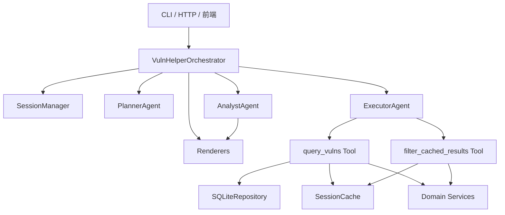

# VulnHelper 详细设计

## 一、文档目的

本文档基于 [概要设计.md](/Users/bg/project/uu-work/agent_apps/vulnhelper/概要设计.md:1) 和 [目录结构设计.md](/Users/bg/project/uu-work/agent_apps/vulnhelper/目录结构设计.md:1) 展开，用于指导在 `agent_apps/vulnhelper/` 下实现一个基于 `agentsdk` 的漏洞查询助手。

本文档不再讨论“是否应该采用多 Agent + Orchestrator”这一总体方向，而是明确给出：

- 文件级模块划分
- 关键领域对象
- Repository 与工具接口
- 三个逻辑 Agent 的输入输出契约
- 四阶段状态机的执行细节
- 报告与表格的渲染方式
- 测试与实施顺序

## 二、实现约束

### 2.1 数据源约束

本应用当前唯一漏洞数据库固定为：

`agent_apps/vulnhelper/data/vulns.db`

数据库主表为 `vulnerability_records`。当前已确认存在如下特点：

- 按扁平列存储漏洞记录
- 存在 `basicinfo.cve_id`、`basicinfo.description`、`evaluation.x_vpt.risk_level` 等基础字段
- 产品名、受影响范围、已知受影响版本、修复版本等信息并未拆成独立关系表，而是大量编码在 `impact.vendors_products` 这类 JSON 字符串数组中

因此，版本范围判断不能完全依赖 SQL。更合理的路径是：

1. SQL 做候选集粗筛
2. Python 解析 `impact.vendors_products`
3. Python 执行版本命中与修复版本推导

### 2.2 Runtime 约束

本应用使用的是 vendored 在当前目录下的 `agent_apps/vulnhelper/agentsdk/` 副本，而不是仓库根目录下的 `agentsdk`。

该本地副本当前可直接利用的主要能力包括：

- `Agent`、`AgentOptions`
- `before_tool_call`、`after_tool_call`
- `transform_context`
- `subscribe()` 事件监听
- `Agent.state` 快照

该副本当前只保留运行时必需文件，不保留上游测试目录和缓存文件。

不应误用或误判的能力包括：

- `session_id` 不是业务会话存储
- `Agent.state.messages` 不是完整业务缓存
- `on_payload` 不是当前稳定的扩展主路径

### 2.3 输出稳定性约束

本应用最终输出要与测试基线尽量稳定对齐，因此：

- 最终 Markdown 结构必须由程序控制
- LLM 只生成受限内容块，不直接生成整份报告
- 表格列顺序、统计行顺序、修复建议位置必须固定

## 三、总体运行模型

### 3.1 组件图



### 3.2 为什么要保留三类 Agent

保留三个逻辑 Agent 的理由在概要设计中已经给出，这里进一步落实到实现细节：

- `PlannerAgent` 必须完全无工具，以从结构上保证阶段一不查库
- `ExecutorAgent` 必须只暴露执行相关工具，以便阶段二和阶段四共用同一受控编译器
- `AnalystAgent` 必须与查询工具隔离，以从结构上保证阶段三只读摘要而不读明细

## 四、文件级详细设计

本节按目标目录树逐文件说明职责、输入、输出和依赖边界。

### 4.1 根目录文件

#### `config.py`

职责：

- 读取数据库路径
- 读取模型配置和系统提示词路径
- 提供默认运行参数

建议定义：

```python
@dataclass
class VulnHelperConfig:
    db_path: Path
    planner_model: ModelInfo
    executor_model: ModelInfo
    analyst_model: ModelInfo
    planner_prompt_path: Path
    executor_prompt_path: Path
    analyst_prompt_path: Path
    max_table_rows: int = 50
```

约束：

- 默认 `db_path` 必须指向 `agent_apps/vulnhelper/data/vulns.db`
- 不允许在其它模块中硬编码数据库绝对路径

#### `bootstrap.py`

职责：

- 构造 Repository
- 构造 SessionCache
- 构造 Renderers
- 构造三个 Agent
- 构造 Orchestrator

对外暴露：

- `build_app(config) -> VulnHelperOrchestrator`

#### `app.py`

职责：

- 提供 CLI 或最小外部入口
- 接收用户输入并调用 Orchestrator
- 输出最终渲染后的文本

不应负责：

- 直接调用 Repository
- 直接访问数据库
- 直接操作 Agent transcript

### 4.2 `application/`

#### `application/dto.py`

职责：

- 定义应用层输入输出 DTO
- 隔离外部接口与内部领域对象

建议对象：

```python
@dataclass
class UserTurnInput:
    session_id: str
    text: str

@dataclass
class UserTurnOutput:
    session_id: str
    state: str
    markdown: str
    metadata: dict[str, Any]
```

#### `application/session_manager.py`

职责：

- 创建和维护 `VulnSession`
- 为 Orchestrator 提供 `get_or_create()`、`save()`、`reset()` 等能力

初版设计：

- 进程内字典缓存即可
- key 为 `session_id`

后续扩展：

- 可切换为 Redis 或数据库存储

#### `application/request_router.py`

职责：

- 读取当前会话状态
- 判断本次输入属于哪种意图：
  - 新查询
  - 确认执行
  - 补充条件
  - 下钻过滤
  - 重置或重新开始

建议定义：

```python
class RoutedIntent(str, Enum):
    NEW_QUERY = "new_query"
    CONFIRM = "confirm"
    REFINE_PLAN = "refine_plan"
    DRILLDOWN = "drilldown"
    RESTART = "restart"
```

路由策略：

- 在 `WAITING_FOR_CONFIRMATION` 状态下优先判定是否为确认
- 在 `REPORT_READY` 或 `DRILLDOWN_READY` 状态下优先判定是否为下钻过滤
- 其它情况默认回到新查询路径

#### `application/orchestrator.py`

职责：

- 作为应用主入口
- 串联四阶段完整执行
- 更新会话状态
- 决定调用哪个 Agent
- 调用 Renderer 生成最终输出

建议对外主接口：

```python
class VulnHelperOrchestrator:
    async def handle_turn(self, input: UserTurnInput) -> UserTurnOutput: ...
```

内部私有方法建议拆为：

- `_handle_new_query()`
- `_handle_confirmation()`
- `_handle_plan_refinement()`
- `_handle_drilldown()`
- `_fail_session()`

### 4.3 `domain/`

#### `domain/enums.py`

定义以下枚举：

- `SessionState`
- `EntryMode`
- `UserGoal`
- `RiskLevel`
- `FixStrategy`

建议：

- 所有跨模块状态值统一从枚举导出
- 不在工具和渲染层散落魔法字符串

#### `domain/models.py`

定义核心领域对象。

建议至少包括：

```python
@dataclass
class QueryPlan:
    entry_mode: EntryMode
    product: str | None
    version_spec: str | None
    vuln_id: str | None
    risk_levels: list[str]
    require_public_poc: bool | None
    require_solution: bool | None
    malicious_only: bool | None
    source_hint: str | None
    user_goal: UserGoal

@dataclass
class VersionRange:
    lower: str | None
    lower_inclusive: bool
    upper: str | None
    upper_inclusive: bool

@dataclass
class ProductImpact:
    product_name: str
    ecosystem: str | None
    affected_ranges: list[VersionRange]
    fixed_versions: list[str]
    known_versions: list[str]

@dataclass
class VulnRecord:
    record_id: str
    cve_id: str | None
    vuln_name: str | None
    description: str
    risk_level: str | None
    cvss_score: float | None
    has_public_poc: bool
    has_solution: bool
    is_malicious: bool
    product_impacts: list[ProductImpact]
    references: list[str]
    raw: dict[str, Any]

@dataclass
class QuerySummary:
    entry_label: str
    target_label: str | None
    initial_candidate_count: int
    filtered_count: int
    highest_risk: str | None
    has_public_poc: bool | None
    has_solution: bool | None
    min_fixed_version_global: str | None
    min_fixed_version_same_branch: str | None
    conclusion: str

@dataclass
class CachedQueryResult:
    cache_id: str
    query_plan: QueryPlan
    matched_records: list[VulnRecord]
    summary: QuerySummary
    created_at: datetime

@dataclass
class FilterSpec:
    risk_levels: list[str] | None
    has_public_poc: bool | None
    has_solution: bool | None
    malicious_only: bool | None
    cve_ids: list[str] | None
    limit: int | None

@dataclass
class VulnSession:
    session_id: str
    state: SessionState
    planned_args: QueryPlan | None
    last_query_result: CachedQueryResult | None
    last_report_markdown: str | None
    last_filter_spec: FilterSpec | None
    created_at: datetime
    updated_at: datetime
    metadata: dict[str, Any]
```

#### `domain/normalization.py`

职责：

- 包名归一化
- 漏洞编号归一化
- 风险等级归一化
- 用户表达转成枚举或标准字段

关键函数建议：

```python
def normalize_package_name(name: str) -> str: ...
def normalize_vuln_id(raw: str) -> str: ...
def normalize_risk_levels(values: Sequence[str]) -> list[str]: ...
def is_confirmation_text(text: str) -> bool: ...
```

策略说明：

- 包名统一转小写、去空白、保留 `-` 和 `_`
- `CVE-2023-49657`、`cve-2023-49657` 应归一到同一格式
- 风险等级统一映射到 `low/moderate/high/critical`

#### `domain/record_parser.py`

职责：

- 把 SQLite 行转换成 `VulnRecord`
- 从 `impact.vendors_products` 中抽取产品、影响范围、修复版本、已知受影响版本

这是本应用最关键的确定性解析模块之一。

##### 4.3.4.1 原始字段形态

当前 `impact.vendors_products` 是 JSON 字符串数组，实际内容类似：

- `"tensorflow-cpu"`
- `"tensorflow-cpu (PyPI)"`
- `"tensorflow-cpu affected range (ECOSYSTEM): >= 0, < 2.5.3"`
- `"tensorflow-cpu fixed in (ECOSYSTEM): 2.5.3"`

因此解析流程必须是：

1. 先 `json.loads()` 解析数组
2. 遍历每一项
3. 用正则识别产品声明、受影响范围、已知受影响版本、修复版本
4. 按产品名归并成 `ProductImpact`

##### 4.3.4.2 关键函数建议

```python
def parse_vendors_products(raw: str | None) -> list[ProductImpact]: ...
def parse_vuln_record(row: Mapping[str, Any]) -> VulnRecord: ...
```

正则建议：

- `^(?P<name>.+?) affected range \(ECOSYSTEM\): (?P<expr>.+)$`
- `^(?P<name>.+?) fixed in \(ECOSYSTEM\): (?P<version>.+)$`
- `^(?P<name>.+?) known affected versions: (?P<versions>.+)$`

#### `domain/versioning.py`

职责：

- 解析版本字符串
- 比较版本大小
- 判断版本是否命中受影响区间
- 为同版本线和全局修复版本给出推导

建议设计：

```python
def parse_version(value: str) -> Version: ...
def parse_range(expr: str) -> VersionRange: ...
def version_in_range(version: str, range_: VersionRange) -> bool: ...
def select_global_min_fixed_version(versions: Sequence[str]) -> str | None: ...
def select_same_branch_fixed_version(current: str, versions: Sequence[str]) -> str | None: ...
```

实现建议：

- 初版优先兼容 Python / 通用 semver 风格包版本
- 若某版本无法标准解析，则保底走字符串比较前先做分段数字化
- 对 `2.x` 这类表达应在 Planner 阶段保留下来，versioning 层支持“前缀版本线”判断

#### `domain/filtering.py`

职责：

- 基于 `QueryPlan` 对候选记录做匹配
- 基于 `FilterSpec` 对缓存结果做二次过滤

建议暴露：

```python
def filter_records(records: Sequence[VulnRecord], plan: QueryPlan) -> list[VulnRecord]: ...
def filter_cached_records(records: Sequence[VulnRecord], filter_spec: FilterSpec) -> list[VulnRecord]: ...
def record_matches_product(record: VulnRecord, product: str) -> bool: ...
def record_matches_version(record: VulnRecord, product: str, version_spec: str) -> bool: ...
```

过滤顺序建议固定：

1. 漏洞编号
2. 产品名
3. 版本命中
4. 风险等级
5. POC / 修复方案
6. 恶意包

#### `domain/summarizer.py`

职责：

- 由匹配结果生成 `QuerySummary`
- 为报告提供统计指标和结论

建议：

- 统计逻辑全部集中在此模块
- 不让 Renderer 自己计算统计值

关键函数：

```python
def build_query_summary(plan: QueryPlan, initial_candidates: int, matched: Sequence[VulnRecord]) -> QuerySummary: ...
def build_analysis_brief(plan: QueryPlan, summary: QuerySummary, records: Sequence[VulnRecord]) -> dict[str, Any]: ...
```

### 4.4 `infra/`

#### `infra/repository.py`

定义抽象接口：

```python
class VulnRepository(Protocol):
    def list_candidates(self, plan: QueryPlan) -> list[dict[str, Any]]: ...
```

初版只需要一个总入口，不必过早拆太多 query 方法。

#### `infra/sqlite_repository.py`

职责：

- 连接 SQLite
- 根据 `QueryPlan` 构造粗筛 SQL
- 返回字典形式原始记录

查询策略建议：

- 若 `vuln_id` 存在，则优先按 `basicinfo.cve_id` 精确查
- 若 `product` 存在，则使用 `impact.vendors_products like ?` 做关键词粗筛
- 恶意包场景可同时匹配 `basicinfo.description` 与 `impact.vendors_products`

注意事项：

- 只做粗筛，不做最终版本判定
- 一律使用参数化 SQL

#### `infra/session_cache.py`

职责：

- 存储 `CachedQueryResult`
- 存储和读取 `VulnSession`

初版建议实现两个类：

```python
class InMemorySessionStore: ...
class InMemoryQueryCache: ...
```

理由：

- 会话对象与查询缓存语义不同
- 后续替换持久化方案时更容易演进

#### `infra/event_logger.py`

职责：

- 订阅 Agent 事件
- 记录摘要日志

日志内容建议包括：

- Agent 名称
- 事件类型
- tool_call_id
- tool_name
- 命中条数摘要
- 错误摘要

不应记录：

- 完整漏洞明细
- 过长的描述全文

### 4.5 `tools/`

#### `tools/schemas.py`

职责：

- 集中管理工具输入 schema
- 避免 schema 散落到工具类中难以维护

建议定义：

- `QUERY_VULNS_SCHEMA`
- `FILTER_CACHED_RESULTS_SCHEMA`

#### `tools/query_vulns.py`

职责：

- 接收结构化查询参数
- 调用 Repository 和 Domain 服务
- 写入缓存
- 返回最小摘要

建议工具参数：

```json
{
  "type": "object",
  "properties": {
    "session_id": {"type": "string"},
    "plan": {"type": "object"}
  },
  "required": ["session_id", "plan"],
  "additionalProperties": false
}
```

执行流程：

1. 从 `plan` 构造 `QueryPlan`
2. 调 Repository 拉取候选
3. `record_parser.parse_vuln_record()` 解析记录
4. `filtering.filter_records()` 应用确定性过滤
5. `summarizer.build_query_summary()` 汇总
6. 写入 `QueryCache`
7. 返回 `AgentToolResult`

返回 `details` 建议结构：

```python
{
    "cache_id": "...",
    "summary": {...},
    "filtered_count": 3,
}
```

返回 `content` 建议只包含一段文本：

- `"query_vulns completed: cache_id=..., matched=3"`

#### `tools/filter_cached_results.py`

职责：

- 读取会话最新缓存结果
- 按 `FilterSpec` 过滤
- 返回精简结果

建议工具参数：

```json
{
  "type": "object",
  "properties": {
    "session_id": {"type": "string"},
    "filter_spec": {"type": "object"}
  },
  "required": ["session_id", "filter_spec"],
  "additionalProperties": false
}
```

返回 `details` 建议包括：

- `filtered_count`
- `rows`
- `applied_filters`

### 4.6 `agents/`

#### `agents/factory.py`

职责：

- 统一从配置构造三个 Agent
- 避免 Orchestrator 感知过多 `agentsdk` 细节

#### `agents/planner.py`

Agent 配置建议：

- 无工具
- `temperature` 较低
- `transform_context` 可选，仅保留最近少量交互

输出契约必须稳定，建议格式如下：

```text
[PLANNED_ARGS_JSON]
{...}

[USER_CONFIRMATION_TEXT]
...确认话术...
```

Orchestrator 负责解析这两个块。

#### `agents/executor.py`

Agent 配置建议：

- 工具：`query_vulns`、`filter_cached_results`
- `tool_execution=SEQUENTIAL`
- 注册 `before_tool_call`
- 注册 `after_tool_call`

##### `before_tool_call` 设计

需要访问应用层会话状态。建议通过闭包或工厂注入 `SessionManager`。

拦截规则：

- 当前阶段不是 `WAITING_FOR_CONFIRMATION` 或 `REPORT_READY/DRILLDOWN_READY` 时，禁止执行
- `query_vulns` 只能使用已确认 `planned_args`
- `filter_cached_results` 必须存在 `last_query_result`

##### `after_tool_call` 设计

统一改写 tool result：

- 成功时仅保留最小摘要文本
- 错误时改写为用户友好的简短错误
- `details` 只保留缓存定位信息和统计摘要，不回传全量记录

#### `agents/analyst.py`

配置建议：

- 无工具
- 低温度
- 输入为 `AnalysisBrief`

输出契约建议：

```text
[EXPERT_ANALYSIS]
...

[FIX_STRATEGY]
...
```

不要让 Analyst 自由输出标题或表格。

### 4.7 `renderers/`

#### `renderers/confirmation_renderer.py`

职责：

- 把 `QueryPlan` 摘要与 Planner 给出的确认话术注入模板

输出要求：

- 突出排查对象
- 明确将执行的策略
- 明确等待用户确认

#### `renderers/report_renderer.py`

职责：

- 基于 `QuerySummary`、`AnalysisBrief`、Analyst 输出和匹配记录渲染最终 Markdown

模板骨架建议：

1. 来源说明
2. 检索主入口
3. 检索统计
4. 已应用过滤
5. 排查对象
6. 结论
7. 专家研判
8. 修复推演
9. CVE 表格

#### `renderers/table_renderer.py`

职责：

- 将下钻过滤结果渲染成紧凑表格

表格列固定：

- `CVE 编号`
- `风险`
- `摘要`

#### `renderers/markdown_helpers.py`

职责：

- 封装表格行宽、截断、转义和空值显示

## 五、会话状态机详细设计

### 5.1 会话状态定义

```python
class SessionState(str, Enum):
    IDLE = "idle"
    WAITING_FOR_CONFIRMATION = "waiting_for_confirmation"
    EXECUTING_QUERY = "executing_query"
    REPORT_READY = "report_ready"
    DRILLDOWN_READY = "drilldown_ready"
    FAILED = "failed"
```

### 5.2 `handle_turn()` 主流程

```python
async def handle_turn(input: UserTurnInput) -> UserTurnOutput:
    session = session_manager.get_or_create(input.session_id)
    intent = request_router.route(session, input.text)

    if intent == RoutedIntent.NEW_QUERY:
        return await _handle_new_query(session, input.text)
    if intent == RoutedIntent.CONFIRM:
        return await _handle_confirmation(session, input.text)
    if intent == RoutedIntent.REFINE_PLAN:
        return await _handle_plan_refinement(session, input.text)
    if intent == RoutedIntent.DRILLDOWN:
        return await _handle_drilldown(session, input.text)
    return await _handle_new_query(session, input.text)
```

### 5.3 阶段一：新查询或补充条件

流程如下：

1. 调用 PlannerAgent
2. 解析 `planned_args`
3. 更新 `session.planned_args`
4. 将 `session.state` 置为 `WAITING_FOR_CONFIRMATION`
5. 用 `confirmation_renderer` 输出确认话术

注意：

- 如果当前已有旧查询结果，这一步视为开启新查询，必须清空旧的 `last_query_result`

### 5.4 阶段二：确认执行

流程如下：

1. 校验当前 `planned_args` 不为空
2. 将 `state` 置为 `EXECUTING_QUERY`
3. 调用 ExecutorAgent，让其发起 `query_vulns` tool call
4. 工具执行完毕后从缓存读取 `CachedQueryResult`
5. 构造 `AnalysisBrief`
6. 调用 AnalystAgent 生成分析文案
7. 由 `report_renderer` 渲染最终报告
8. 将 `state` 置为 `REPORT_READY`

### 5.5 阶段四：下钻过滤

流程如下：

1. 校验当前存在 `last_query_result`
2. 调用 ExecutorAgent，让其发起 `filter_cached_results`
3. 用 `table_renderer` 渲染表格
4. 将 `state` 置为 `DRILLDOWN_READY`

### 5.6 错误路径

任一阶段出现致命错误时：

1. 将 `state` 置为 `FAILED`
2. 保存错误摘要到 `metadata`
3. 返回固定格式错误提示

## 六、PlannerAgent 设计

### 6.1 输入

输入为用户原始自然语言问题。

### 6.2 输出格式

PlannerAgent 必须输出固定可解析格式：

```text
[PLANNED_ARGS_JSON]
{
  ...
}

[USER_CONFIRMATION_TEXT]
...
```

### 6.3 Prompt 约束

系统提示词必须包含以下硬约束：

- 只能做语义解析和计划生成
- 不能调用任何工具
- 不能输出 chain-of-thought
- 缺信息时可以在确认话术中体现，但 `planned_args` 必须尽量结构化

### 6.4 `planned_args` 建议字段

```json
{
  "entry_mode": "product_version",
  "product": "tensorflow-cpu",
  "version_spec": "2.4.1",
  "vuln_id": null,
  "risk_levels": [],
  "require_public_poc": null,
  "require_solution": true,
  "malicious_only": null,
  "source_hint": null,
  "user_goal": "fix_version"
}
```

## 七、ExecutorAgent 设计

### 7.1 职责

ExecutorAgent 不是“会分析的安全助手”，而是“工具参数编译器”。

其系统提示词必须明确：

- 若当前模式为查询执行，只调用 `query_vulns`
- 若当前模式为缓存过滤，只调用 `filter_cached_results`
- 严格遵循给定 schema
- 绝不添加未确认参数

### 7.2 阶段二输入

建议传入一段程序生成的受控上下文：

```text
Current mode: query_execution
Approved session_id: ...
Approved query_plan:
{...}
Instruction:
Use query_vulns with exactly the approved query_plan and session_id.
Do not modify fields. Do not explain.
```

### 7.3 阶段四输入

建议传入：

```text
Current mode: drilldown_filter
Session id: ...
Available cache: yes
User drilldown request:
只看高危的
Instruction:
Compile the request into filter_cached_results arguments only.
```

## 八、AnalystAgent 设计

### 8.1 输入

输入为程序生成的 `AnalysisBrief` 文本块，不带完整 CVE 明细。

### 8.2 输出格式

```text
[EXPERT_ANALYSIS]
...

[FIX_STRATEGY]
...
```

### 8.3 Prompt 要求

- 只根据给定摘要生成建议
- 不要编造不存在的修复版本
- 若没有覆盖全部漏洞的同版本线修复版本，应明确指出

## 九、Repository 详细设计

### 9.1 连接方式

SQLiteRepository 使用只读连接为佳，建议：

```python
sqlite3.connect(f"file:{db_path}?mode=ro", uri=True)
```

### 9.2 候选集查询策略

#### 按漏洞编号查询

```sql
select * from vulnerability_records
where "basicinfo.cve_id" = ?
```

#### 按产品关键词查询

```sql
select * from vulnerability_records
where lower("impact.vendors_products") like ?
```

#### 恶意包查询补充

可增加：

```sql
or lower("basicinfo.description") like ?
```

### 9.3 为什么不在 SQL 层做版本判断

因为受影响范围并不是独立列，而是埋在 `impact.vendors_products` 文本数组中。即使能用 `LIKE` 做模糊判断，也无法稳定支持：

- 多区间范围
- 开闭区间
- 同版本线修复版本推导
- 精准版本比较

因此版本语义必须放在 Domain 层。

## 十、版本语义设计

### 10.1 支持的版本表达

初版至少支持：

- 精确版本：`2.4.1`
- 主版本线：`2.x`
- 次版本线：`2.4.x`
- 范围表达：`>=2.4,<2.5`

### 10.2 命中规则

#### 精确版本

若用户给出精确版本，则只要任一 `affected_range` 命中即可判定该记录受影响。

#### 版本线

若用户给出 `2.x` 或 `2.4.x`，则判定规则为：

- 受影响区间与该版本线存在重叠，即视为“当前版本线可能受影响”
- 修复建议优先寻找同版本线内可用的最小修复版本

### 10.3 修复版本推导

定义两个指标：

- `min_fixed_version_global`
- `min_fixed_version_same_branch`

含义如下：

- 全局最低修复版本：覆盖命中记录的候选修复版本中的全局最小安全版本
- 同版本线修复版本：在当前版本线中能命中的最小修复版本；若不存在则为 `None`

## 十一、工具执行与 Hook 设计

### 11.1 `before_tool_call`

#### 查询执行模式

如果工具名为 `query_vulns`：

- 会话必须处于 `WAITING_FOR_CONFIRMATION`
- 参数中的 `session_id` 必须与当前会话一致
- 参数中的 `plan` 必须与 `session.planned_args` 结构相等

#### 下钻模式

如果工具名为 `filter_cached_results`：

- 会话必须处于 `REPORT_READY` 或 `DRILLDOWN_READY`
- 必须存在 `last_query_result`

#### 拦截后的返回

一律返回受控错误结果，例如：

- `当前会话尚未确认查询，不能执行漏洞检索`
- `当前会话没有可下钻的缓存结果`

### 11.2 `after_tool_call`

成功返回时：

- `content` 改成极小摘要
- `details` 保留摘要统计和 cache_id

失败返回时：

- 统一错误文案
- 不泄漏内部栈信息

## 十二、上下文裁剪设计

### 12.1 为什么需要 `transform_context`

尽管本方案已经把三个逻辑 Agent 分开，但同一 Agent 内仍可能积累较长 transcript，尤其是 ExecutorAgent 在阶段四多次下钻后。

建议为 ExecutorAgent 提供 `transform_context`：

- 仅保留最近一轮系统补充上下文
- 移除历史 tool result 中无意义的摘要文本
- 必要时只保留最近一次成功工具调用和最近一次用户请求

### 12.2 Planner 与 Analyst 的上下文策略

- PlannerAgent：保留最近一到两轮用户输入即可
- AnalystAgent：通常单轮调用，无需复杂裁剪

## 十三、渲染设计

### 13.1 确认话术渲染

确认阶段输出建议结构：

1. 提取到的排查对象
2. 即将执行的检索策略
3. 需要用户确认的明确提示

### 13.2 报告渲染

报告模板字段建议包括：

```python
{
    "source_label": "本地漏洞库",
    "entry_label": "...",
    "stats_line": "...",
    "applied_filters_line": "...",
    "target_label": "...",
    "conclusion": "...",
    "expert_analysis": "...",
    "fix_strategy": "...",
    "rows": [...],
}
```

### 13.3 表格渲染

表格行数据建议统一为：

```python
{
    "cve_id": "...",
    "risk_label": "...",
    "summary": "...",
}
```

## 十四、测试设计

### 14.1 单元测试

应覆盖：

- `normalize_package_name`
- `parse_vendors_products`
- `parse_range`
- `version_in_range`
- `filter_records`
- `build_query_summary`

### 14.2 Repository 测试

应验证：

- 按 `cve_id` 能查到记录
- 按产品关键词能查到候选集
- SQL 粗筛后能正确交给 Python 层精筛

### 14.3 工具测试

应验证：

- `query_vulns` 返回预期 cache_id 和统计结果
- `filter_cached_results` 在无缓存时能返回可控错误
- `before_tool_call` 会正确拦截越权执行

### 14.4 Orchestrator 测试

应覆盖完整四阶段链路：

1. 用户输入问题
2. 返回确认话术
3. 用户确认
4. 返回报告
5. 用户下钻过滤
6. 返回表格

### 14.5 Golden 测试

以 `tests/vuln_agent_cases.json` 为输入，`tests/vuln_golden_answers.json` 为基线，做输出近似比对。

比对重点：

- 统计信息
- 结论
- 修复建议
- 表格内容

## 十五、建议的实现顺序

### 15.1 第一步：领域与数据层

实现以下文件：

- `domain/models.py`
- `domain/normalization.py`
- `domain/record_parser.py`
- `domain/versioning.py`
- `domain/filtering.py`
- `domain/summarizer.py`
- `infra/sqlite_repository.py`

完成目标：

- 能从 `data/vulns.db` 中查出候选记录
- 能解析版本范围
- 能给出查询摘要

### 15.2 第二步：缓存与工具

实现：

- `infra/session_cache.py`
- `tools/query_vulns.py`
- `tools/filter_cached_results.py`

完成目标：

- 能独立在不接 Agent 的情况下完成查询与过滤

### 15.3 第三步：渲染层

实现：

- `renderers/`
- `templates/`

完成目标：

- 确认话术、报告和表格能稳定渲染

### 15.4 第四步：Agent 封装

实现：

- `agents/`
- `prompts/`

完成目标：

- Planner / Executor / Analyst 均可独立跑通

### 15.5 第五步：业务编排

实现：

- `application/`
- `bootstrap.py`
- `app.py`

完成目标：

- 用户能按四阶段完成完整交互

## 十六、结论

`vulnhelper` 的正确实现路径，不是“写一个会查漏洞的大模型”，而是“围绕本地漏洞数据库构建一个程序主导、模型受控参与的查询系统”。详细落地时必须坚持四点：

- 业务状态机由 Orchestrator 控制
- 版本范围与过滤逻辑由 Domain 层确定性执行
- 完整漏洞数据只进入应用缓存，不直接暴露给模型
- 最终输出结构由模板和 Renderer 决定

只要这四点不动摇，`agentsdk` 就能很好地承担运行时底座的角色，而不会反客为主变成难以约束的黑盒工作流。
